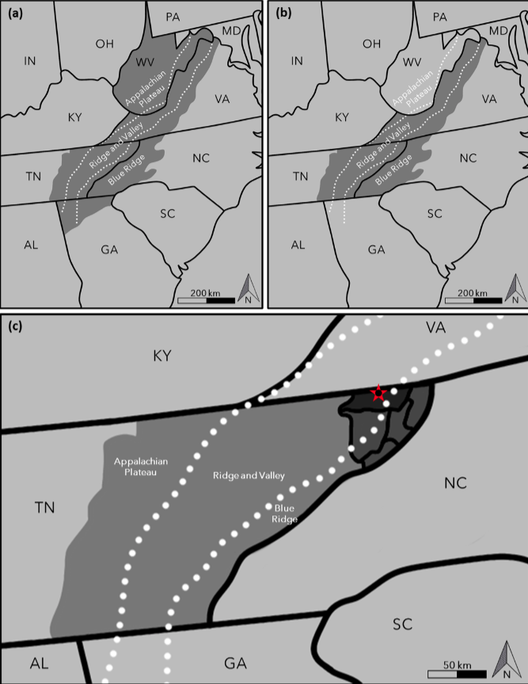
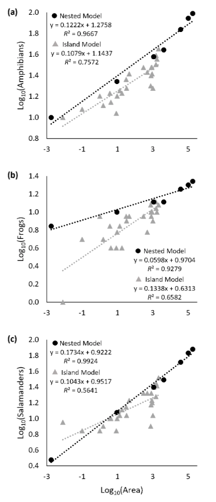

# Nested and Island Models for Determining the Species-Area Relationship of Southern Appalachian Amphibians

**Jeremy B. Stout1,\*, Lance D. Jessee1, & John N. McMeen2**

*Journal of North American Herpetology* 2025(1): 1–7. March 2025.

1The Nature Center at Steele Creek Park, 80 Lakeshore Drive, Bristol, Tennessee 37620, USA. 2School of Technology, Western Governors University, Millcreek, Utah 84107, USA.
\*Corresponding author: biostout@gmail.com

ORCID: Jeremy B. Stout 0000-0001-8747-3561 · Lance D. Jessee 0009-0003-4171-3269 · John N. McMeen 0009-0003-8141-567X

---

## Abstract

Amphibians are widespread vertebrates in the temperate and tropical regions of the world that are facing global existential threats. The southern Appalachian region of eastern North America is an important stronghold for temperate amphibians, representing the global biodiversity hotspot for salamander genera and includes high rates of endemism. Despite a rich history of sampling in the region, a species-area relationship (SAR) for amphibians has not been attempted. We used nested and island site data from the southern Appalachian ecoregion to create linear regressions of two SAR models for predicting amphibian species richness. Our results indicate that land area is an accurate predictor of amphibian species richness within the study area. This model offers a rapid assessment of amphibian diversity and should be useful in conservation and land management initiatives. Identifying baseline biodiversity trends is vital for understanding species distributions into an uncertain future.

**Key Words.** amphibians, conservation, frogs, salamanders, SAR, southern Appalachians, species richness

## Introduction

Amphibians (Class Lissamphibia) are widespread in the temperate and tropical regions of the world, comprising more than 7,000 extant species in three taxonomic orders: Gymnophiona (caecilians), Anura (frogs and toads), and Urodela (salamanders and newts) (Vitt and Caldwell 2009). They are found in terrestrial and aquatic environs on every continent except Antarctica (Pough et al. 2004). Ecologically, they are all carnivorous as adults and can make up most of the vertebrate biomass in some ecosystems (Gibbons et al. 2006). Most undergo a gilled larval stage and exhibit a diphasic life history, metamorphosing into air-breathing, terrestrial (or semi-terrestrial) adults (Pough et al. 2004).

The southern Appalachian ecoregion is made up of the Appalachian Plateau, Ridge and Valley, and Blue Ridge physiographic provinces and represents the global biodiversity hotspot for salamander genera (Stein et al. 2000). More than 20 species of anurans and 75 species of salamanders are known from the region (Duellman and Sweet 1999), with new species being described regularly due to the illumination of cryptic diversity by modern molecular methods (e.g. Highton 2004, Felix et al. 2019). A single salamander family (Plethodontidae) encompasses most of the region's amphibian diversity (Kiester 1971). Most of its members likely originated as a result of fragmenting habitat associated with global cooling and drying phases beginning in the Pliocene Epoch, 5 million years before present (Highton 1995). At least two extant genera and one subfamily of plethodontids were present within the study area at that time (Boardman and Schubert 2011).

Regional diversity among southern Appalachian amphibians is correlated along elevational gradients and based upon available moisture (Kiester 1971). Many species are sympatric across their overall distribution, but often mutually exclusive at specific sites (Ford et al. 2002). High rates of endemism among amphibians are found in the southern Appalachians and the taxonomic diversity is unlike that found in lowland areas to the east and west (Duellman and Sweet 1999).

Amphibian populations have experienced global declines as a result of habitat loss, invasive species introductions, pollution, and disease (Green et al. 2020), all of which are exacerbated by large-scale patterns of climate change (Rollins-Smith 2020). Though the decline has been reported since the late 20th century, its exact causes are still poorly understood (Green et al. 2020). The limited dispersal ability paired with relatively high diversity of amphibians in the southern Appalachian ecoregion make them especially important sentinels for regional and global conservation concerns and prospective mitigation efforts (Zhu et al. 2022).

Despite the ecological importance and biodiversity of the group and the rich history of naturalists' investigations in the region, no quantitative effort has been made to establish a baseline species-area relationship (SAR) of southern Appalachian amphibians until the current study. A cursory examination of total herpetofaunal species richness in eastern Tennessee suggested that Appalachian amphibians fit a predictable species-area curve remarkably well (adjusted R² = 0.98, Jessee et al. 2022). Here, we expand the amphibian SAR nested model to the broader geographic scope of the southern Appalachians and compare that to another SAR model using data sets sampled from individual sites within the study area (island model). The creation and comparison of these models is an early effort to establish a realistic SAR for use in ecological, conservation, and land management applications.

## Materials and Methods

We define the southern Appalachian ecoregion here as the entire state of West Virginia, western Virginia east to the Blue Ridge physiographic boundary illustrated in Mitchell and Reay (1999), eastern Tennessee as defined in Jessee et al. (2022), western North Carolina high and low mountains illustrated in the Amphibians of North Carolina (Petranka et al. 2024), and the Blue Ridge, Ridge and Valley, and Appalachian Plateau of Georgia as illustrated in Jensen et al. 2008 (Figure 1). Portions of eastern Kentucky, northern Alabama, and northeastern South Carolina should be included in this analysis, but were omitted due to a lack of readily accessible species occurrence data for these regions.

Preliminary results from our earlier work (Jessee et al. 2022) suggested a strong correlation between amphibian species richness and land area in eastern Tennessee. Here, we increased the scope and reworked the model (nested model, Appendix 1), then compared that with a separate model based upon compiled species occurrence data from published (or otherwise vetted) sources within the study area (island model, Appendix 2). The nested model represents a single instantiation of a nearly infinite number of possible nests, but was chosen due to its centralized location within the study area and the quality of its included data sources.

Land area was calculated using county or state land areas (eastern Tennessee and West Virginia) and by digitizing polygons in Google Earth Pro for western Virginia, western North Carolina, and northern Georgia. Our nested model is the result of a sample of seven increasingly larger land areas ranging from a single 0.0018 km² wetland pond to the entirety of southern Appalachia at 178,757 km² as defined in this study (Figure 1). The smallest site is a wetland pond at Steele Creek Park in Bristol, Tennessee, USA (Area 1) followed by all of Steele Creek Park (Area 2). Encompassing Areas 1 and 2 is Sullivan County, Tennessee (Area 3). Area 4 is the five-county area of northeastern Tennessee followed by eastern Tennessee (Area 5), both defined in Jessee et al. (2022). Area 6 adds western North Carolina high and low mountains (Petranka et al. 2024) and the Blue Ridge, Ridge and Valley, and Appalachian Plateau of western Virginia (Mitchell and Reay 1999). Area 7 adds West Virginia (West Virginia Division of Natural Resources 2023) and the Blue Ridge, Ridge and Valley, and Appalachian Plateau of Georgia (Jensen et al. 2008) (Figure 1). Our island model includes published amphibian species occurrence data from 26 (mostly public land) sites within the study area that include data collection from exhaustive sampling efforts and/or spanning multiple collecting events over the course of years or decades (Appendix 2).

For both the nested and island SAR models, we created species richness samples by class, order, and increasing geographical area (see Appendices). Species richness (independent variable) and geographical area (dependent variable) samples were logarithmically (log₁₀) transformed, and a regression analysis was performed to determine the statistical relationship between the variables. Regression modeling provided theoretical slope (z) and intercept (C) values for the formula S = CA^z, or in log-log form as log(S) = log(C) + zlog(A) (Arrhenius 1921). Using the same regression model, z and C values were fitted for the island data to compare with the nested model. We then compared the predictive model outputs.

**Figure 1.** Areas used in the models: (a) Area 7, the southern Appalachian ecoregion as utilized herein and the geographic envelope of all island sites; (b) Area 6; (c) Areas 1 (black dot inside red star), 2 (red star), 3 (Sullivan County, darkest gray), 4 (five-counties in northeastern Tennessee), and 5 (all of eastern Tennessee). Descriptions of each nested area are found in the text. Dotted lines represent divisions of physiographic boundaries. Note: Appalachian portions of Kentucky, South Carolina, and Alabama were not included due to lack of adequate amphibian occurrence data.

## Results

The following z and C constants were fitted from the nested data: frogs z = 0.0598, C = 9.34; salamanders z = 0.1734, C = 8.36; amphibians z = 0.1222, C = 18.87. For each group, the linear regressions reflect a significant positive correlation between geographical area and species richness in frogs (R² = 0.9279, p = 5.0 × 10⁻⁴), salamanders (R² = 0.9924, p = 1.73 × 10⁻⁶), and amphibians (R² = 0.9667, p = 6.94 × 10⁻⁵).

For the island model: frogs z = 0.134, C = 4.28; salamanders z = 0.104, C = 8.95; amphibians z = 0.108, C = 13.92. For each group, the linear regressions reflect a predictably lower (but still positive) correlation between land area and species richness: frogs (R² = 0.658, p = 4.96 × 10⁻⁷), salamanders (R² = 0.564, p = 9.818 × 10⁻⁶), and amphibians (R² = 0.757, p = 7.699 × 10⁻⁹).

**Figure 2.** Nested and island predictive models as linear regressions. (a) amphibians (total), (b) frogs, (c) salamanders.

## Discussion

While the nested model over-predicts reported amphibian species richness when compared with the island model, we suspect that this is at least partially an artifact of underreported diversity at sample sites and that increased sampling of all sites within the study area will approach the nested predicted value. The lines from both the nested model and island model follow similar trajectories (Figure 2), which suggests that these species-area curves are reflective of a natural phenomenon. The island model slope for frogs is greater than the nested (by 0.073) and smaller for salamanders (−0.069) (Figure 2.b and 2.c), but this could be due to the type of area used for the smallest nested site (a single wetland pond with high anuran but low salamander richness). It is also possible the nested model approaches an environmental carrying capacity of probable diversity.

The nested model is probably strongest at small (<1 km²) and large (>1,000 km²) scales but less so with intermediate land areas based on current data. Smaller units of well-sampled areas (such as parklands) offer the best adherence to the models and likely reflect fuller data sets and thus, more accurate species counts. Larger land areas, likewise, encompass multiple data sets from diverse habitats within the overall geographic envelope that, when taken together, approach the predicted nested species count for the area. Greater sampling at all scales will refine both models. The island model is probably best at small to medium scales (<2200 km²) as that is where all of its data originate.

The island model predictably underreported diversity based upon land area, as "areas are measured accurately, while species are often grossly underdocumented" (Gould 1979). This model is probably an effective cursory approach to identifying readily reportable observational data. Whether conservative (island data) or expansive (nested data), these models show that overall amphibian diversity is correlated with land area across physiographic provinces within the southern Appalachians.

An average of the two predictive models should be a reasonable estimate of amphibian diversity at most localities within the study area (in the absence of direct data). One site reported (University of Tennessee Arboretum) has a land area which approximates 1 km² (1.01 km²). Its reported amphibian species richness (16 amphibian species, 9 frogs, 7 salamanders) falls between the C values of the two models (Nested C = 18.9 amphibian species, 9.3 frogs, 8.4 salamanders; Island C = 13.9 amphibian species, 4.3 frogs, 9.0 salamanders), providing a compelling datum that C is indicative of a "real" value and not simply an artifact of data extrapolation (Gould 1979). A species richness calculator based on these models is available as supplementary information or from the authors.

Areas higher than 515 m above sea level (which makes up most of the southern Appalachian region) are expected to lose significant portions of their habitat suitable for amphibians (Alves-Ferreira et al. 2022). While topographical diversity may aid in amphibian conservation by buffering against some effects of climate change (Anderson et al. 2014), many species already exist at their thermal maxima and have limited dispersal ability (Milanovich et al. 2010). Some of the highly diverse southern Appalachian plethodontids are already restricted to their current realized climatic zones and every species in the Appalachians could experience habitat loss as a result of climate change (Milanovich et al. 2010). Additionally, amphibians exhibit the highest rate of endemism among North American vertebrates, but are inadequately protected across their range (Jenkins et al. 2015).

Our models offer a rapid parametric assessment of amphibian diversity within sites of potential interest across the southern Appalachians. The fit of amphibian species to the lines combined with the limited dispersal abilities and high rates of endemism of the group means that these methods could be adapted to identify and evaluate the SAR for other areas of conservation concern, and could be an important tool for amphibian conservation. Identifying baseline biodiversity trends is vital both for current conservation concerns and land use efforts, but also for forecasting species distributions into an uncertain future.

## Acknowledgments

The authors wish to thank all of the unknowing contributors of herpetological data that formed the basis of this report. Sam Koscielniak assisted with figure preparation. Thanks also to the editor and reviewers for their constructive comments.

## Appendix 1

Data and calculations used in the nested model. Seven concentric land areas of increasing size are defined and correlated with published amphibian data (defined in text and shown in Figure 1).

| Taxon | Species | Log₁₀ Species | Land area (km²) | Log₁₀ Area |
|---|---:|---:|---:|---:|
| **Amphibians** | | | | |
| Area 1 | 10 | 1.000 | 0.0018 | −2.745 |
| Area 2 | 22 | 1.342 | 9.3 | 0.968 |
| Area 3 | 38 | 1.580 | 1,114 | 3.047 |
| Area 4 | 44 | 1.643 | 4,137 | 3.617 |
| Area 5 | 69 | 1.839 | 37,438 | 4.573 |
| Area 6 | 88 | 1.944 | 101,271 | 5.005 |
| Area 7 | 98 | 1.991 | 178,758 | 5.252 |
| **Frogs** | | | | |
| Area 1 | 7 | 0.845 | 0.0018 | −2.745 |
| Area 2 | 10 | 1.000 | 9.3 | 0.968 |
| Area 3 | 13 | 1.114 | 1,114 | 3.047 |
| Area 4 | 13 | 1.114 | 4,137 | 3.617 |
| Area 5 | 18 | 1.255 | 37,438 | 4.573 |
| Area 6 | 20 | 1.301 | 101,271 | 5.005 |
| Area 7 | 22 | 1.342 | 178,758 | 5.252 |
| **Salamanders** | | | | |
| Area 1 | 3 | 0.477 | 0.0018 | −2.745 |
| Area 2 | 12 | 1.079 | 9.3 | 0.968 |
| Area 3 | 25 | 1.398 | 1,114 | 3.047 |
| Area 4 | 31 | 1.491 | 4,137 | 3.617 |
| Area 5 | 52 | 1.716 | 37,438 | 4.573 |
| Area 6 | 68 | 1.833 | 101,271 | 5.005 |
| Area 7 | 76 | 1.881 | 178,758 | 5.252 |

Area 1 = wetland pond at Steele Creek Park, Bristol, Tennessee, USA; Area 2 = Steele Creek Park, Bristol, Tennessee; Area 3 = Sullivan County, Tennessee; Area 4 = northeastern Tennessee (Jessee et al. 2022); Area 5 = eastern Tennessee (Jessee et al. 2022); Area 6 = Area 5 plus western North Carolina high and low mountains (Petranka et al. 2024) and the Blue Ridge, Ridge and Valley, and Appalachian Plateau of western Virginia (Mitchell and Reay 1999); Area 7 = Area 6 plus West Virginia (West Virginia Division of Natural Resources 2023) and the Blue Ridge, Ridge and Valley, and Appalachian Plateau of Georgia (Jensen et al. 2008).

## Appendix 2

Data used in the island model.

| Site | Amphibians | Frogs | Salamanders | Land area (km²) |
|---|---:|---:|---:|---:|
| John's Bog (TN)¹ | 10 | 1 | 9 | 0.0081 |
| Henderson Bog (TN)¹ | 12 | 5 | 7 | 0.101 |
| UT Arboretum (TN)² | 16 | 9 | 7 | 1.01 |
| Sweet's Farm (VA)³ | 13 | 5 | 8 | 1.57 |
| Cantonment Area (WV)⁴ | 17 | 7 | 10 | 3.78 |
| Briery Mountain (WV)⁴ | 14 | 4 | 10 | 4.23 |
| Pringle Tract (WV)⁴ | 11 | 4 | 7 | 8.54 |
| Harper's Ferry NHP (WV)⁵ | 16 | 6 | 10 | 9.65 |
| New River State Park (NC)⁶ | 18 | 7 | 11 | 13.45 |
| Elk Knob State Park (NC)⁶ | 17 | 4 | 13 | 17.9 |
| Gorges State Park (NC)⁶ | 23 | 9 | 14 | 31.2 |
| Radford Army Ammunition Plant (VA)⁷ | 19 | 8 | 11 | 32.7 |
| Gauley River NRA (WV)⁵ | 26 | 9 | 17 | 46.57 |
| New River Gorge NP (WV)⁵ | 30 | 9 | 21 | 294.64 |
| Unicoi County (TN)⁸ | 27 | 6 | 21 | 481.7 |
| Whitfield County (GA)⁹ | 20 | 12 | 8 | 753.69 |
| Shenandoah NP (VA)⁵ | 25 | 10 | 15 | 799 |
| Watauga County (NC)¹⁰ | 30 | 9 | 21 | 809.63 |
| Anderson County (TN)⁸ | 30 | 13 | 17 | 893.6 |
| Murray County (GA)⁹ | 26 | 10 | 16 | 898.73 |
| Fannin County (GA)⁹ | 19 | 8 | 11 | 1,015.28 |
| Polk County (TN)⁸ | 38 | 13 | 25 | 1,144.8 |
| Hamilton County (TN)⁸ | 32 | 13 | 19 | 1,491.8 |
| Sevier County (TN)⁸ | 39 | 11 | 28 | 1,548.8 |
| Buncombe County (NC)¹⁰ | 36 | 10 | 26 | 1,709.4 |
| Great Smoky Mountains NP (TN/NC)⁵ | 45 | 12 | 33 | 2,114 |

Sources: ¹Crockett 2001; ²University of Tennessee Institute of Agriculture 2020; ³Weisenbeck et al. 2022; ⁴Spurgeon 2002; ⁵National Park Service 2023; ⁶North Carolina State Parks 2023; ⁷Garriock and Reynolds 2005; ⁸Niemiller and Reynolds 2011; ⁹Jensen et al. 2008; ¹⁰Petranka et al. 2024.

## Literature Cited

Alves-Ferreira, G., Talora, D.C., Solé, M., Cervantes-López M.J. and Heming, N.M. (2022). Unraveling global impacts of climate change on amphibians' distributions: A life-history and biogeographic-based approach. *Frontiers in Ecology and Evolution*, 10, 1–12. https://doi.org/10.3389/fevo.2022.987237

Anderson, M.G., Clark, M., and Sheldon, A.O. (2014). Estimating climate resilience for conservation across geophysical settings. *Conservation Biology*, 28(4), 959–970. https://doi.org/10.1111/cobi.12272

Arrhenius, O. (1921). Species and area. *Journal of Ecology*, 9, 95–99. https://doi.org/10.2307/2255763

Boardman, G.S. and Schubert, B.W. (2011). First Mio-Pliocene salamander fossil assemblage from the southern Appalachians. *Palaeontologia Electronica*, 14(2), 19 p.

Crockett, M.E. (2001). Survey and comparison of amphibian assemblages in two physiographic regions of northeast Tennessee. (Thesis) East Tennessee State University. https://dc.etsu.edu/etd/35

Duellman, W.E. and Sweet, S.S. (1999). Distribution patterns of amphibians in the Nearctic Region of North America. Chapter 2 in Duellman, W.E. (Ed.). *Patterns of Distribution of Amphibians: A Global Perspective*. The Johns Hopkins University Press, 633 p. https://doi.org/10.56021/9780801861154

Felix, Z.I., Wooten, J.A., Pierson, T.W. and Camp, C.D. (2019). Re-evaluation of the Wehrle's salamander (*Plethodon wehrlei* Fowler and Dunn) species group (Caudata: Plethodontidae) using genomic data, with the description of a new species. *Zootaxa*, 4609(3), 429–448. https://doi.org/10.11646/zootaxa.4609.3.2

Ford, M.W., Menzel, M.A., and Odom, R.H. (2002). Elevation, aspect, and cove size effects on Southern Appalachian Salamanders. *Southeastern Naturalist*, 1(4), 315–324. https://doi.org/10.1656/1528-7092(2002)001[0315:EAACSE]2.0.CO;2

Garriock, C.S., and Reynolds, R. (2005). Results of a herpetofaunal survey of the Radford Army Ammunition Plant in southwestern Virginia. *Banisteria*, 25, 3–22.

Gibbons, J.W., Winne, C.T., Scott, D.E., Willson, J.D., Glaudas, X., Andrews, K.M., Todd, B.D., Fedewa, L.A., Wilkinson, L., Tsaliagos, R.N. and Harper, S.J. (2006). Remarkable amphibian biomass and abundance in an isolated wetland: implications for wetland conservation. *Conservation Biology*, 20(5), 1457–1465. https://doi.org/10.1111/j.1523-1739.2006.00443.x

Gould, S.J. (1979). An allometric interpretation of species-area curves: the meaning of the coefficient. *The American Naturalist*, 114(3), 335–343. https://doi.org/10.1086/283482

Green, D.M., Lannoo, M.J., Lesbarrères, D., and Muths, E. (2020). Amphibian population declines: 30 years of progress in confronting a complex problem. *Herpetologica*, 76(2), 97–100. https://doi.org/10.1655/0018-0831-76.2.97

Highton, R. (1995). Speciation in eastern North American salamanders of the genus *Plethodon*. *Annual Review of Ecology and Systematics*, 26(1), 579–600. https://doi.org/10.1146/annurev.es.26.110195.003051

Highton, R.A. (2004). A New Species of Woodland Salamander of the *Plethodon cinereus* Group from the Blue Ridge. *Jeffersoniana*, 14, 1–22.

Jenkins, C.N., Van Houtan, K.S., Pimm, S.L., and Sexton, J.O. (2015). US protected lands mismatch biodiversity priorities. *Proceedings of the National Academy of Sciences*, 112(16), 5081–5086. https://doi.org/10.1073/pnas.1418034112

Jensen, J.B., Camp, C.B., Gibbons, W., & Elliott, M. (Eds.). (2008). *Amphibians and Reptiles of Georgia*. Athens, GA: University of Georgia Press.

Jessee, L.D., Stout, J.B. and McMeen, J.N. (2022). Herpetofauna of Steele Creek Park (Sullivan County, TN), with comments on species–area relationships of amphibians and reptiles in eastern Tennessee. *Southeastern Naturalist* 21(1), 63–73. https://doi.org/10.1656/058.021.0110

Kiester, A.R. (1971). Species density of North American amphibians and reptiles. *Systematic Zoology*, 20(2), 127–137.

Milanovich, J.R., Peterman, W.E., Nibbelink, N.P., and Maerz, J.C. (2010). Projected loss of a salamander diversity hotspot as a consequence of projected global climate change. *PLoS One*, 5(8), e12189. https://doi.org/10.1371/journal.pone.0012189

Mitchell, J.C. and Reay, K.K. (1999). *Atlas of Amphibians and Reptiles in Virginia*. Virginia Department of Game and Inland Fisheries, Richmond, VA.

National Park Service, U.S. Department of the Interior. NPSpecies. (accessed 2023, December 6). https://irma.nps.gov/NPSpecies/Search/SpeciesList

Niemiller, M.L., and Reynolds, R.G. (2011). *The Amphibians of Tennessee*. Knoxville, TN: University of Tennessee Press.

North Carolina State Parks. Natural Resources Inventory Database. (accessed 2023, December 6). https://auth1.dpr.ncparks.gov/nrid/public.php

Petranka, J.W., Hall, S., Howard, T., & LeGrand, H. (2024). *Amphibians of North Carolina*. Raleigh, NC: North Carolina Biodiversity Project and North Carolina State Parks. Available from https://auth1.dpr.ncparks.gov/amphibians/index.php

Pough, F.H., Andrews, R.M., Cadle, J.E., Crump, M.L., Savitzky, A.H., and Wells, K.D. (2004). *Herpetology* (3rd edition). Prentice Hall, Upper Saddle River, NJ.

Rollins-Smith, L.A. (2020). Global amphibian declines, disease, and the ongoing battle between *Batrachochytrium* fungi and the immune system. *Herpetologica*, 76(2), 178–188. https://doi.org/10.1655/0018-0831-76.2.178

Spurgeon, A.B. (2002). Comparison of herpetofaunal species composition and response to edge on the Camp Dawson Collective Training Area, Preston County, West Virginia. (Thesis) West Virginia University. https://researchrepository.wvu.edu/etd/1499/

Stein, B.A., Kutner, L.S., Hammerson, G.A., Master, L.L., and Morse, L.E. (2000). State of the States: geographic patterns of diversity, rarity, and endemism. Chapter 5 in Stein, B.A., Kutner, L.S., and Adams, J.S. (editors). *Precious Heritage: The Status of Biodiversity in the United States*. The Nature Conservancy.

University of Tennessee Institute of Agriculture. (2020). Amphibians and reptiles. UT Arboretum. https://utarboretum.tennessee.edu/amphibians-and-reptiles/

Vitt, L.J., and Caldwell, J.P. (2009). *Herpetology*, 3rd edition. Elsevier Publishing. https://doi.org/10.1016/B978-0-12-374346-6.00001-8

Weisenbeck, D.R., Nelson, E.M., and McLeod, D.S. (2022). Herpetological inventory at Sweet's Farm in Highland County, Virginia. *Banisteria*, 56, 118–136.

West Virginia Division of Natural Resources. (accessed 2023, December 6). Amphibians & Reptiles. https://wvdnr.gov/plants-animals/amphibians-reptiles/

Zhu, G., Giam, X., Armsworth, P.R., Cho, S.H., and Papes, M. (2022). Biodiversity conservation adaptation to climate change: protecting the actors or the stage. *Ecological Applications*, e2765. https://doi.org/10.1002/eap.2765
